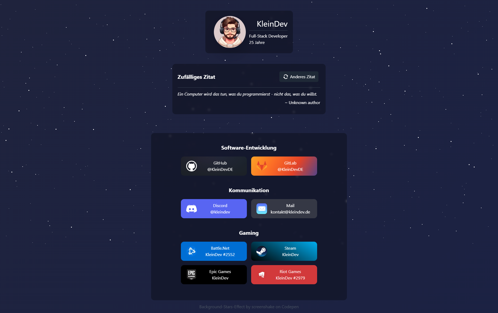

# Linktree

This is my own version of the popular linktree.  
It's written in HTML, CSS and JS, also it's responsive.

### Functions:
* Random quote (defined in quotes.json)
* Animations on hovering the buttons

### Preview
Also visible at https://links.kleindev.de

### Copyright
Background-Image by [coolvector on Freepik](https://www.freepik.com/free-vector/dark-hexagonal-background-with-gradient-color_12804210.htm#query=background&position=21&from_view=search&track=sph)